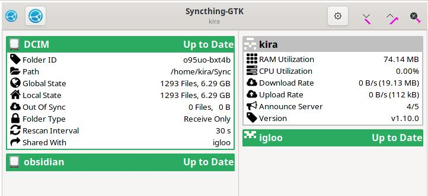
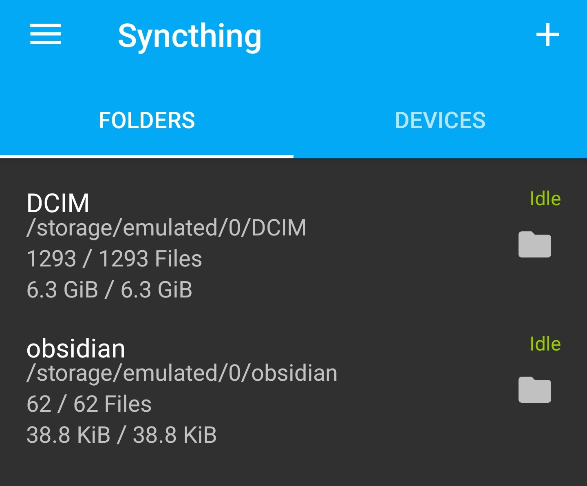
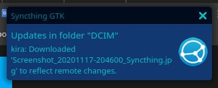
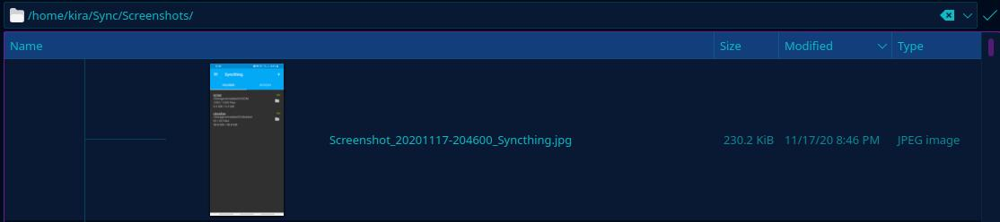

# Just what is Syncthing?

Well, you have some amount of data that you want to be able to access from multiple devices without having to manually sync it(copy paste it over one device to another) everytime you make a change to that data, be that adding/removing.

Enter syncthing.

Its an awesome(Open source, E2E Encrypted, Portable, Simple) continuous file synchronization tool that takes care of, well, sycning your data.  
You can have a central data server from where you make your data accessible to other devices or you can simply connect two devices to sync your data between.

Lets see an example for the latter case.

One of my use cases for Syncthing is to sync my Photos(DCIM) folder of my Android phone to my Linux machine(/home/user/Sync)

It looks something like this:

Now, whenever I take a picture on my Android phone (in this case I took a screenshot of my Syncthing setup):

It gets synced to my Linux machine:

Now I have access to the screenshot I took on my Android phone:

Syncthing has many configurations, such as in this case, I set it up (at Linux's end) to only receive and on my Android end, Send only.

Why not just use Google Cloud or a similar service?  
Well, Because that requires you to upload your data to a public server (God knows what they're doing with your data) basically a middleman, creating a single point of failure and high threat surface.

While, Syncthing provides you the same service without any risks to your privacy and security.
You can connect multiple remote devices(connected to each other) to share your data with or you can have central database that connects multiple devies, the possibilities are endless.

Did I mention its free to use?

Starting using Syncthing right now. [Download](https://syncthing.net/downloads/)
