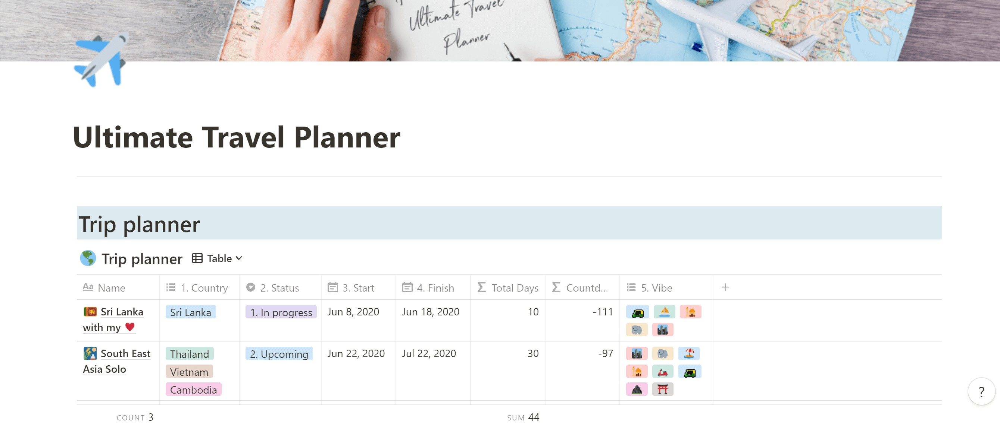
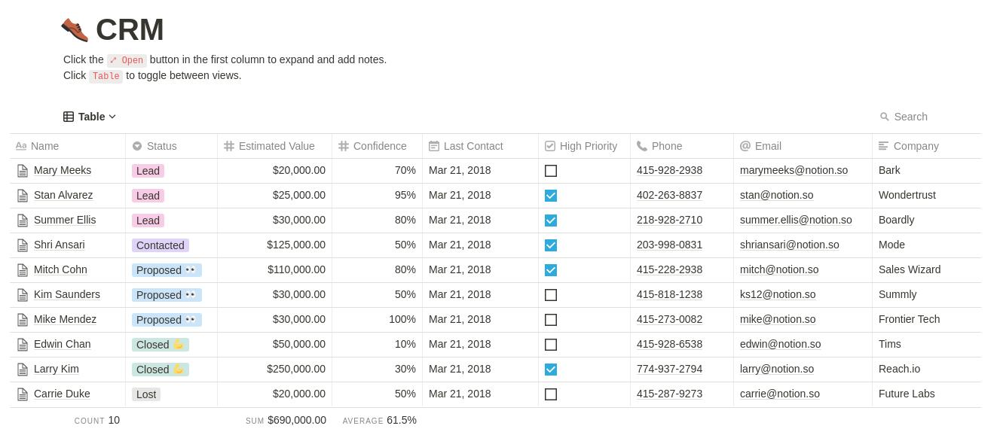
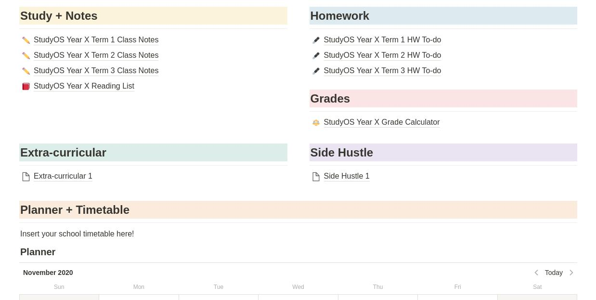
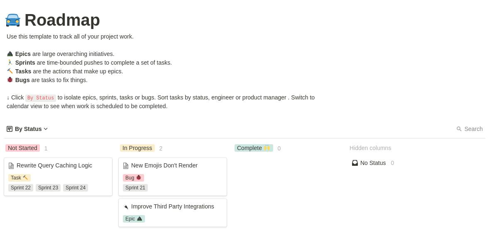

**_Download from [here](https://www.notion.so/)_**

Before Notion, I used Onenote, it was okayish but boy is Notion a beast.

Its got everything you'll ever need to be productive or to just simply take a note/memo.

Notion combines multiple features from many different applications and serves you in a neatly wrapped and not to mention extremely fast workspace.

What can you do with Notion?

- Project management
- Blogging
- Note taking
- CRM (Customer relationship management)
- Team collaboration
- Personal Knowledge management
- Tasks/Todo Management
- Planners
- Spreadsheets

Notion is full customizable, you can embed content, set due dates/reminders, use markdown.
It also uses drag and drop block styling.

###### Need to take down plans for vacation/travel? Make a new page and get wild.

Embed Google Maps, track expenses, make a checklist, use calendar for your overall itinerary.

###### Need to make a database for your customers? Notion has got you covered.

###### Need to make a study planner? You can do that on Notion.

###### Need a roadmap for your new project? Do it Kanban style.

Make yourself a Zettelkasten style PKM or a content repository with Notion.  
Download Notion's [web clipper](https://www.notion.so/web-clipper) for easy bookmarking and importing of content from the web.

If you're not feeling like setting it up yourself just download free to use templates from [Notion Templates](https://www.notion.so/Notion-Template-Gallery-181e961aeb5c4ee6915307c0dfd5156d)

Oh, its also got a dark mode.

What? you want more? a good fella named dragonwocky made [Notion Enhancer](https://github.com/dragonwocky/notion-enhancer)  
This mod is for the desktop app, which gives it the ability for custom themeing and a few really cool enhancements.

Heck! You can even make your own website with zero coding using Notion and [Fruition](https://fruitionsite.com/)

You're already using a note taking app? Just import it to Notion. [Here's how](https://www.notion.so/Import-data-into-Notion-18c37b470e8941789548b68049af750b)

Well, That's it for today folks!  
Thank you for reading, Have a good one °˖✧◝(⁰▿⁰)◜✧˖°
